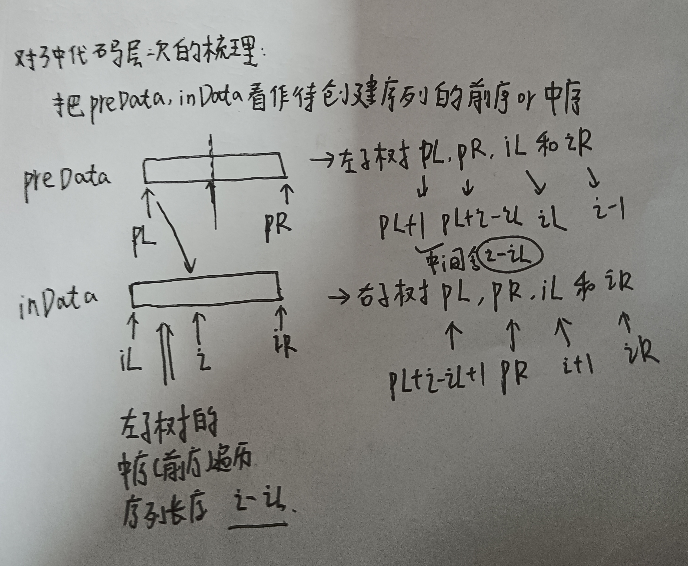
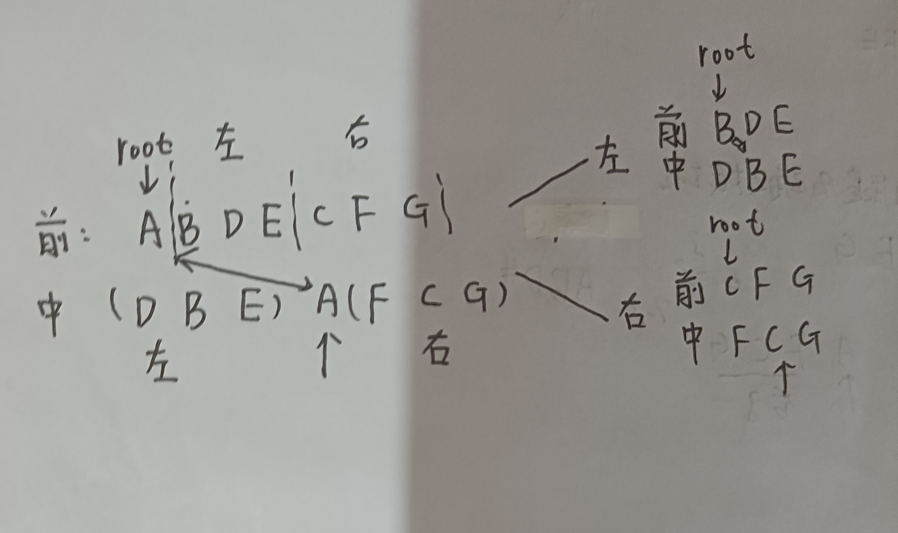
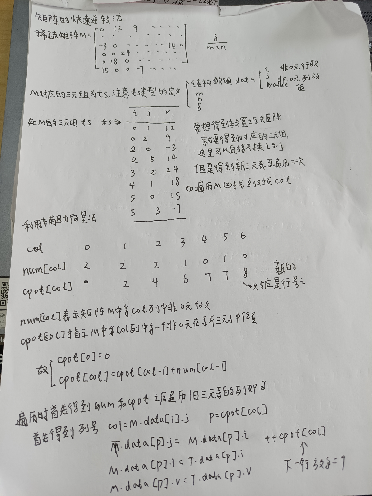

# T1 将二叉树对称变化
1. 算法思想: 首先还是利用递归的方法,需要将二叉树对称变化只用把二叉树每一个节点的左右孩子交换(注意就是整体的交换),逐层递归即可
2. 时间性能和空间性能分析: 无论是链式实现还是顺序实现,时间复杂度和空间复杂度都是O(n)
# T2 计算二叉树的深度
1. 算法思想: 还是利用递归的方法,递归的含义就是把向下一层的待求量当成已知量,在之后的利用向下一层的已知量求解返回结果了,这里也是一样,首先每一次的初始高度就是1,利用递归算法其实每一次层的高度就是1加上左子树或者右子树的最大高度即可
2. 时间复杂度和空间复杂度: 无论是顺序实现还是链式实现,时间复杂度和空间复杂度都是O(n)
# T3 利用先序遍历和中序遍历确定二叉树
1. 算法思想: 此时还是要多关注二叉树本身,不要过多关注空节点,此时还是利用递归算法,此时需要利用区间进行遍历,根据先序遍历找到根节点,利用中序遍历确定左右子树的长度即可
2. 细节: 注意递归结束的条件是无法遍历preData和inData,二者相辅相成
3. 算法思想图解:

4. 时间复杂度为O(n),空间复杂度为O(n)
# T4 层次遍历二叉树
1. 算法思想: 利用队列的数据结构,不断把树中的节点入队,出队时就可以把他的左右孩子入队,出队时访问
2. 空间复杂度和时间复杂度: 时间复杂度是O(n),空间复杂度O(1)
# T5 获取二叉树的宽度
1. 算法思想： 还是利用队列的数据结构,只是每一次都要记录队列中的元素,下一次把队中元素全部出队,把之后的元素入队
2. 空间复杂度和时间复杂度: 时间复杂度O(n)(每个元素出队一次,入队一次),空间复杂度O(1)
# T6 获取节点个数
1. 算法思想: 可以利用递归或者队列的数据结构,每一次就是1+左子树节点+右子树节点
2. 空间复杂度和时间复杂度都是O(n)
# T7 见后面的T12
# T8 求解二叉树第K层的节点个数
1. 算法思想: 基本和T5的思想一致,只是需要记录层数
2. 空间复杂度和时间复杂度: 时间复杂度O(n),空间复杂度为O(1)
# T9 求解叶子节点的个数
1. 算法思想: 还是利用递归的方法,如果当前节点为NULL,就可以返回1,树的叶子节点就是左子树的叶子节点和右子树的叶子节点之和
2. 空间复杂度和时间复杂度都是O(n)(每一次节点都判断了一次)
# T10 判断两棵树的结构是否相同
1. 算法思路: 利用递归的思想,注意终止条件,一个为空一个不为空或者都为空
2. 空间复杂度和时间复杂度都是O(n)
# T11 两个节点中两个节点的最低公共祖先节点
1. 算法思路: 还是利用递归法,但是这里的递归添加不是特别明显的,就是如果遍历到自己本身,其实就是head=null或者head=自己就可以返回了(找到了节点),如果分布在父树两边就可以返回父树
2. 算法思路补充: 递归的三种情况:
   1. head=其中一个,直接返回head,因为前面都遍历完了没有找到,遍历剩余这一个子树时就可以返回了
   2. head=NULL,直接返回NULL
   3. head不等于每一个,继续遍历head的左右子树即可,如果左右子树都找到了对应元素就可以返回head(分居两侧)
# T12 利用非递归方式实现前序遍历中序遍历和后序遍历
## 实现中序遍历
1. 算法思路: 利用栈的数据结构,但是在元素入栈或者元素出栈的时候需要遵循一定的规则:
   1. 首先要不断寻找左孩子,不断把左孩子入栈
   2. 如果左孩子为空就可以把栈顶元素出栈,之后把node的指向转向右边孩子,并且出栈时需要访问元素
   3. 直到栈空并且节点为空遍历结束
2. 对于这个问题的深层理解:
   1. 为什么一定要不断寻找左孩子?   因为遍历顺序总是从左到右的,这里其实就是向左找到最深层次的哪一个子树
   2. 为什么出栈之后要把指向指向右孩子? 想一下,此时栈顶元素其实就是最深层次的子树的根节点,出栈之后访问栈顶元素其实就是访问了根节点对应的元素,之后需要访问右孩子,把右孩子作为操作对象
## 实现先序遍历
1. 算法思路: 和上面一样就是入栈时访问(为什么? 因为遍历顺序就是根->左->右,遍历顺序就是从上而下的,所以不断遍历根节点(左孩子充当根节点),最后没有左孩子就轮到右孩子了)
## 实现后序遍历
1. 算法思路: 还是利用栈的数据结构,但是入栈和出栈需要遵循如下规则:
   1. 首先不断入栈左孩子
   2. 左孩子为空之后,判断栈顶元素,如果栈顶元素的右孩子为空并且没有被访问过,就可以把右孩子入栈,同时把右孩子作为当前节点,找到他的左孩子
   3. 如果没有这样的右节点,就可以把当前节点出栈(保证了右节点在根节点上面),注意设置一个标志位指定是否访问对应元素
# 实现稀疏矩阵
1. 算法思想: 见下图

2. 细节分析: 注意这里辅助向量的最小长度必须要大于稀疏矩阵对应的三元组的最大列数
3. 时间复杂度为O(n)(相当于辅助向量表,三元组遍历一次),空间复杂度,消耗了两个三元表和辅助向量表的空间 
